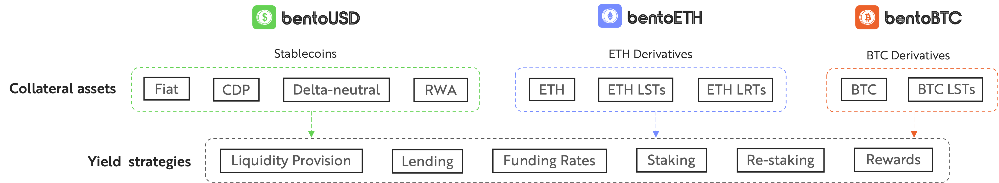

# bentoX Assets

bentoX assets are liquid ERC-20 tokens pegged to the value of X and fully backed by a diversified portfolio of blue-chip X-denominated collateral tokens, generating yield through multiple strategies on top-tier DeFi platforms. These tokens simplify yield generation on mainstream digital assets by aggregating and optimizing liquidity and yields from various collateral assets and strategies into a single token. They are fully redeemable for the underlying collateral, with users able to mint or swap seamlessly without direct exposure to the underlying infrastructure or yield strategies. Collateral assets are held 1:1 and used for secure lending, liquidity provision, staking, funding rate arbitrage, and Real World Asset (RWA) strategies. Each bentoX token is named according to its primary underlying asset, such as bentoUSD, bentoETH, or bentoBTC, backed by USD stablecoins, ETH derivatives, and BTC derivatives, respectively, all generating yield with diverse DeFi, CeFi, and TradFi strategies.

<figure><figcaption></figcaption></figure>

bentoX tokens do not automatically earn a yield, rather these must be staked or locked in some specific contracts in order to start earning. Bento offers two mechanisms for the yield generation:

1. **Stake bentoX:** bentoX tokens can be staked to receive bentoX+ tokens, allowing users to earn the X-Bento Savings Rate (BSR), aggregated and optimized yield from a diverse range of underlying collateral assets and DeFi protocols.
2. **Lock bentoX:** bentoX tokens can be locked within the Bento protocol to receive locked bentoX (bentoX++), which provides governance voting power and lets users choose between the enhanced native yield of collateral assets or BENTO token emissions. This unique economic model is designed to distribute value and governance power to the long term users and reward early participation.
