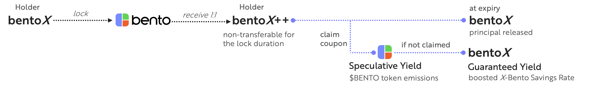

# Locking

Users seeking either guaranteed, enhanced native yield or speculative yield in the form of $BENTO tokens can lock their bentoX tokens in a locking contract for a specified period. In return, they receive locked bentoX (bentoX++) on a 1:1 basis with the locked bentoX. These assets remain locked for the duration of the maturity period, offering users multiple benefits.

<figure><figcaption></figcaption></figure>

Bento’s locking model is designed to outperform the X-Bento Savings Rate i.e. native  yield of the underlying assets. It incentivizes early entrants and ensures a sustainable flywheel effect.

**Principal Security:** The locked bentoX remains secure, ensuring the safety of the initial investment.

**Uncapped rewards:** If the $BENTO yield is higher than the boosted X-Bento Savings Rate, users can claim the tokens and benefit from it.

**Guaranteed yield:** Otherwise, users claim the X-Bento Savings Rate yield in bentoX, boosted by the circulating supply of bentoX that is neither locked nor staked. &#x20;

**Governance voting power:** bentoX++ holders also gain governance voting power, allowing them to participate in key protocol decisions related to the introduction of new collateral assets, strategies, portfolio allocations etc.

The maximum lock period is 6 months and the minimum lock period is one month. During the lock period, users can claim speculative yield in the form of $BENTO tokens, which are distributed daily to bentoX++ holders. $BENTO token emissions accumulate over time, but if a user decides to claim the $BENTO yield, he forgoes the X-Bento Savings Rate yield. If a user chooses to unlock their locked bentoX before the lock period concludes, they will forfeit a portion of the accumulated yield. Once the lock period ends, users receive their principal back and can opt for unclaimed rewards in either $BENTO tokens or guaranteed yield in the form of bentoX tokens, equivalent to the native yield boosted by the liquidity of unlocked and unstaked bentoX. The longer the bentoX tokens are locked, the greater the boosted native yield or $BENTO token emissions, along with increased governance voting power in the protocol.

Bento adopts a unique economic model where the yield generated by collateral assets is pooled to form the protocol’s treasury. In return, users receive $BENTO governance tokens, giving them control over the protocol, treasury, and future revenues providing extra value to the yield distributed in this form. This system redistributes both revenue and ownership, creating strong incentives for early adopters, offering them significant upside potential.\
