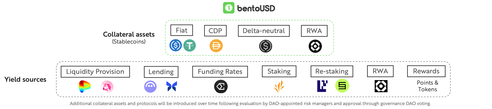

# bentoUSD

bentoUSD is a multi-collateral yield-generating synthetic stablecoin designed to provide stable and superior risk-adjusted yields for holders while maintaining a 1:1 peg to the USD. It is fully backed by a diversified basket of blue-chip stablecoins with various mechanism designs, including fiat-backed stablecoins, synthetic stablecoins backed by CDPs and delta-neutral strategies, and tokenized RWA backed stablecoins. bentoUSD is a fully decentralised and permissionless stablecoin featuring a novel all-weather stablecoin design unifying both liquidity and yields from various stablecoins into one stablecoin. bentoUSD can offer consistent and better risk-adjusted yields than other stablecoin protocols in both bull and bear markets by dynamically allocating the underlying collateral assets generating yields from DeFi, CeFi and TradFi sources.

bentoUSD provides a liquid, non-custodial savings product for USD stablecoins, designed to cater to all types of users—whether they prefer low-risk, stable, and convenient yields that are aggregated and optimised from DeFi, CeFi, and TradFi sources, or speculative yields through token rewards. bentoUSD is a fully permissionless and on-chain verifiable omni-chain stablecoin that can be staked for bentoUSD+ to potentially achieve better risk-adjusted yields than individual stablecoins, with both bentoUSD and bentoUSD+ being fully composable within the DeFi ecosystem. Additionally, bentoUSD can be locked within the Bento system to earn either boosted native yields from the underlying stablecoins or BENTO token emissions, while also granting governance voting power.

<figure><figcaption></figcaption></figure>

bentoUSD is currently backed by the following stablecoins with diverse stability mechanisms and yield generating strategies:

**Fiat stablecoins:** They are pegged to a fiat currency, such as the US dollar, to maintain a stable value and backed by reserves of the fiat currency or equivalent assets, ensuring their price stability. E.g. USDC, USDT. These stablecoins can be further used to generate the yield using diverse DeFi strategies like lending, market making, incentive farming and new primitives like restaking USDC, USDT on shared security protocols.

**CDP stablecoins:** Collateralized Debt Position stablecoins, are cryptocurrencies created by locking up collateral in a smart contract to issue new stablecoins. The value of these stablecoins is maintained through over-collateralization, ensuring stability despite market fluctuations. E.g. DAI. DAI (Maker DAO) is further deposited on Spark Finance for sDAI to earn yield via the DAI Savings Rate (DSR).

**Delta-neutral stablecoins:** Delta neutral stablecoins are designed to maintain a stable value regardless of market movements by balancing long and short futures positions in collateral assets. This strategy aims to eliminate exposure to price fluctuations, allowing users to earn yields from perpetual futures funding rates while minimising risk. E.g. Ethena USDe. USDe can be further staked for sUSDe to access the Ethena protocol's generated yield from positive funding rates.

**RWA backed stablecoins:** They are yield-generating stablecoins usually collateralized by U.S. Treasury bills (T-bills) and designed to generate yield for their holders. By investing the collateral in T-bills, these stablecoins not only maintain price stability through the backing of safe government securities but also earn interest on the T-bills, which can be distributed to users as yields. They can also be backed by other RWAs like corporate bonds, commodities etc. E.g. USDM, OUSD, USYC.\
